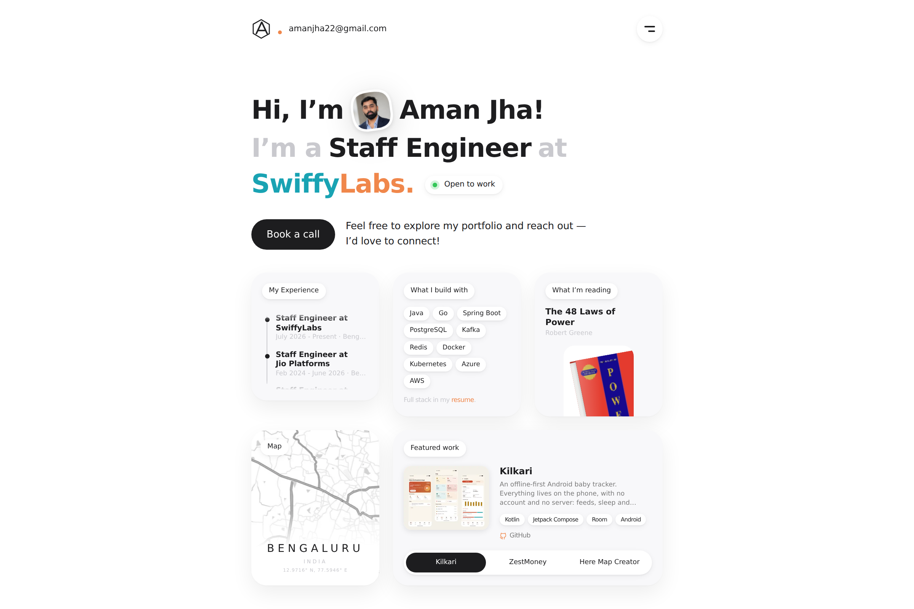

<h1 align="center">Aman Jha</h1>

<p align="center">
  Source of <a href="https://amnjha.github.io" target="_blank">amnjha.github.io</a>, a personal portfolio built with <a href="https://www.gatsbyjs.com/" target="_blank">Gatsby</a> and published on <a href="https://pages.github.com/" target="_blank">GitHub Pages</a>.
</p>



## What's on the page

A single bento-style home page:

| Section                                                       | Where it comes from                                                                      |
| ------------------------------------------------------------- | ---------------------------------------------------------------------------------------- |
| Hero: name, role, company, "Open to work" pill, "Book a call" | `src/config.js` (`role`, `company`, `openToWork`, `bookCallUrl`) and `src/images/me.jpg` |
| My Experience                                                 | One markdown file per role in `content/jobs/`                                            |
| What I build with                                             | `skills` in `src/config.js`                                                              |
| What I'm reading                                              | `reading` in `src/config.js`; cover image in `src/images/books/`                         |
| Map                                                           | `location` in `src/config.js`; map image at `src/images/map/bengaluru.jpg`               |
| Featured work                                                 | One folder per project in `content/featured/` (markdown + cover image), tabbed by `date` |
| Resume button (menu)                                          | `static/aman_resume.pdf`                                                                 |

Social links and the menu entries are also in `src/config.js`. The blog under `/pensieve/` is built from `content/posts/`.

## Running locally

Requires Node 20 (`.nvmrc`) and [Yarn 1](https://classic.yarnpkg.com/).

```sh
nvm install
yarn install --frozen-lockfile
yarn develop      # http://localhost:8000 with hot reload
```

Production build and preview:

```sh
yarn build
yarn serve        # http://localhost:9000
```

The `build` and `develop` scripts set `NODE_OPTIONS=--openssl-legacy-provider`, which Gatsby 3's webpack 4 needs on Node 17 and newer.

## Deploying

There are two routes. Both publish the same `public/` build; pick one in **Settings → Pages → Source**.

**GitHub Actions** (source: _GitHub Actions_). `.github/workflows/gatsby.yml` runs on every push to `main`: install, build, upload the artifact and deploy, in one job.

**From your machine** (source: _Deploy from a branch_, branch `gh-pages`, folder `/`). Builds locally and pushes `public/` to the `gh-pages` branch:

```sh
yarn deploy
```

## Design

Light canvas, orange accent (`#f0874b`) with teal (`#19a3b3`) for the first half of the company name, near-black ink and light-grey muted text. Cards sit on a `#f8f8fa` surface with a soft shadow and white label pills. Tokens live in `src/styles/variables.js`, shared button and card styles in `src/styles/mixins.js`, and the home page sections in `src/components/sections/`.

Layout inspired by a bento-style portfolio reference; the original scaffold was [Brittany Chiang's v4](https://github.com/bchiang7/v4).
